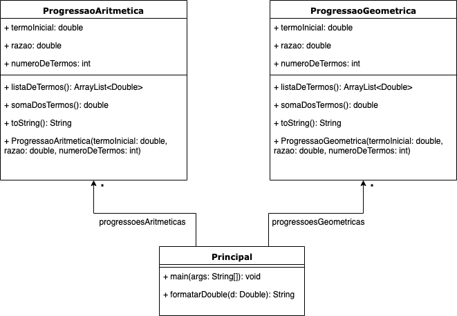

### UnB - Universidade de Brasilia
### FGA - Faculdade do Gama
### OO - Orientação a objetos

Seção II - Exercício 3:

Progressões aritméticas e geométricas são sequências de n números reais iniciadas à partir de um valor inicial a0 em que a relação entre quaisquer dois números se dá por uma constante c (também chamada de razão). Em progressões aritméticas um dado número é calculado pelo seu anterior somado à constante c, ao passo que em progressões geométricas um dado número é calculado pelo seu anterior multiplicado pela constante c. Para ambas progressões é ainda possível calcular a soma de todos os seus termos. Isso exposto, faça um programa que para cada progressão aritmética ou geométrica solicitada pelo usuário leia os valores de a0, n e r e calcule os valores da progressão. Ao final da execução o programa deverá apresentar para cada progressão gerada os termos que a compõem e o valor de sua soma de termos.

*Resolução parcial*:

Diagrama de classes:  

Este diagrama de classes poderia ser aprimorado utilizando conceitos mais avançados de Orientação a Objetos, como o polimorfismo.
